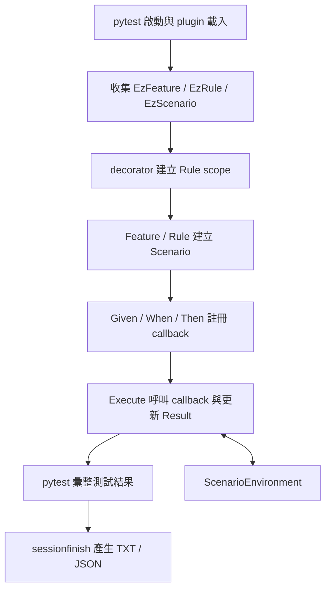

# EzScenarioPython 專案研究

研究日期：2026-09-22。研究基準：`243db61`（`feat: implement ezSpec for Python`）。
本次閱讀程式、執行現有測試、驗證報告流程，並針對 pytest 整合及並行執行做最小重現；未修改框架實作。

## 已確認的產品方向（2026-09-23）

- 使用者要能像使用 ezSpec 一樣，方便閱讀測試內容與結果。
- Scenario Outline 每列資料都要成為可獨立顯示、篩選、重跑的 pytest 測試。
- 依使用者最新更正，缺少 Examples 時按照 Java：未呼叫 WithExamples 的 Outline 不執行 callback，也不報錯。明確呼叫 WithExamples 並傳入空集合時，仍保留 Java 原有的參數檢查錯誤。
- 上述更正取代先前「缺少測試資料必須報錯」的要求；每列資料可獨立顯示、篩選、重跑的需求仍保留。
- Pending 的 pytest 狀態尚未確認，本次更正只處理缺少 Examples 的行為。

以上是目標需求；下文的執行語意和測試結果記錄的是目前實作。
Java 原始碼、動態測試樹與報告的後續對照，見 [Java 參考分析](JAVA_REFERENCE.md)。
使用者已接受 Examples 放到 decorator、方法回傳情境的 API 方向；第一版已於 2026-09-23 實作完成，結果見 [Outline 逐列測試設計](PYTEST_OUTLINE_DESIGN.md)。下文保留修改前的研究紀錄。

## 專案定位

依 Python README 描述，這是 Java ezSpec 2.0.4 的 Python 移植，提供以 Python 撰寫的 BDD internal DSL。
開發者用 Feature、Rule、Scenario、Given、When、Then 描述規格，將實際操作和斷言寫在 callback 中，由 pytest 收集並執行測試。

- 發布套件名稱：`ezscenario-python`，目前版本 `0.1.0.dev0`；Python import 名稱：`ezspec`。
- 要求 Python 3.11 以上；開發依賴為 pytest 8 以上。
- `pyproject.toml` 沒有宣告核心 runtime dependencies；pytest 位於 `dev` extra。
- Java 風格的 CamelCase API 和部分 snake_case alias 並存。
- README 指定的 Java 參考版本為 `061eadc8dd47510bf12d62dd87d3fdaa0a37b20d`；本機相鄰的 `ezspec-java-reference` HEAD 確實符合。
- 2026-09-23 補查：該 Java commit 的根目錄 `pom.xml` 將 revision 設為 `2.0.5`，與 Python README 的版本文字不同；比對以 commit 為準。
- 支援 TXT、JSON living documentation，未實作 Java 版本的 React／HTML dashboard。

這次沒有執行 Java 測試或完整逐項比對跨語言行為，因此不能由 Python 測試通過推論所有 Java 相容性均已驗證。

## 架構與責任

| 位置 | 責任 |
| --- | --- |
| `src/ezspec/__init__.py` | 對使用者提供簡潔 public API |
| `src/ezspec/keyword/feature.py`、`rule.py` | Feature／Rule／Background 的組織與情境建立 |
| `src/ezspec/keyword/scenario.py` | 步驟註冊、循序執行、錯誤策略、群組內並行執行 |
| `src/ezspec/keyword/scenario_outline.py` | Examples 展開、變數替換、逐列執行與錯誤彙整 |
| `src/ezspec/keyword/environment.py` | callback 共用資料、當前參數、歷史參數與表格 |
| `src/ezspec/keyword/table/`、`argument.py`、`examples.py` | 表格、文字參數與資料驅動測試資料 |
| `src/ezspec/runtime_context.py` | 用 ContextVar 管理 decorator 選取的 Rule |
| `src/ezspec/extension/pytest/decorators.py` | 標記規格類型、包裝執行期間的 Rule scope |
| `src/ezspec/extension/pytest/plugin.py` | 自訂 pytest 收集與 marker，串接報告生命週期 |
| `src/ezspec/extension/pytest/reporting.py` | 記錄需輸出的 feature class，在 session 結束時產生報告 |
| `src/ezspec/report/` | TXT Visitor、JSON DTO、語系和檔案輸出 |
| `src/ezspec/feature.py` 等舊平面模組 | 相容性 re-export，實作應追到 canonical subpackage |
| `tests/` | 框架本身的單元測試、public API 與整合行為測試 |
| `examples/` | 可直接執行的使用範例，也是預設測試的一部分 |

核心模型透過 framework-neutral 的 `runtime_context` 取得 Rule，沒有直接呼叫 pytest。
報告模組讀取執行後的模型和 Result；TXT 透過 Visitor 遍歷，JSON 透過 DTO 序列化。
這些界線讓核心 DSL、runner adapter 與報告格式可以分開維護。



## 實際執行語意

1. **收集**：安裝套件後由 `pytest11` entry point 載入 plugin；專案內的 `tests/conftest.py` 和 `examples/conftest.py` 提供未安裝時的 fallback。
2. **規格建立**：decorator 讓 class／method 不必以 `Test`／`test_` 命名。測試檔本身仍需符合 pytest 的檔案發現規則。
3. **延後執行**：`.Given(...).When(...).Then(...)` 只是註冊 callback；直到 `.Execute()` 才執行操作和斷言。
4. **資料傳遞**：一個 runtime scenario 內的 callbacks 共用 `ScenarioEnvironment`。`$20000`、`${VAT=0.05}` 等參數在每個步驟開始時解析；自訂資料用 `put()`／`get()` 傳递。
5. **失敗策略**：預設遇到失敗即停止，後續步驟標記 Skip；`ContinuousAfterFailure` 允許繼續，最後以 `EzSpecError` 彙整失敗。
6. **Pending**：只更新步驟 Result，後續步驟仍會執行；沒有其他失敗時，pytest 會顯示 passed。現有測試明確要求此行為。
7. **Outline**：`.WithExamples()` 為每列建立 runtime scenario，將 `<column>` 替換成該列資料。各列循序執行，失敗會在所有列執行後彙整。
8. **並行**：`ExecuteConcurrently()` 把 Given／When／Then（也含 ThenSuccess／ThenFailure）當作群組起點，其後的 And／But 屬於同一群組；群組內用 ThreadPoolExecutor 並行，群組之間等待完成。Outline 的資料列本身仍循序執行。
9. **報告**：CLI 或 decorator 啟用輸出；generator 讀取 class 上名為 `feature` 的欄位。預設輸出到 `build/ezspec-report/`，檔名使用 module 和 class 的完整名稱。

## 操作方式

在專案根目錄使用：

```powershell
# 初次安裝開發環境
python -m pip install -e ".[dev]"

# 全部測試：tests 加 examples
python -m pytest -q

# 只跑框架本身的測試
python -m pytest tests -q

# 只跑使用範例，並產生報告
python -m pytest examples -q --ezspec-report

# 依情境類型或名稱篩選
python -m pytest examples -m ezscenario_outline -q
python -m pytest examples -k tax -q
```

安裝是 README 的建議操作；本次直接使用已有的 Python／pytest，沒有重新安裝環境。

## 驗證結果

環境：Windows、Python 3.11.2、pytest 8.3.3。

| 驗證 | 結果 |
| --- | --- |
| 現有完整測試 | **119 passed，0.68 秒** |
| 範例與實際報告 CLI | **9 passed，0.37 秒** |
| 報告檔案 | 4 個 Feature，各一份 TXT 和 JSON，共 8 檔 |
| JSON 中實際展開後的情境 | 26 個 runtime scenarios，合計 102 個步驟，均為 Success |
| 額外 pytest 相容性 probe | **2 failed、5 passed、1 error**，詳見下節；不在預設 testpaths 中 |

完整測試採用下列設定，停用 pytest cache 寫入並保留測試暫存資料：

```powershell
$env:PYTHONDONTWRITEBYTECODE='1'
python -B -m pytest -q -p no:cacheprovider -o tmp_path_retention_policy=all -o tmp_path_retention_count=1000000
```

9 個範例已包含於 119 個測試中，不應相加為 128 個不同測試。
119 是 pytest item 數量，也不等於 Outline 展開後的資料列或步驟數。
本次未量測 line／branch coverage，亦未測試其他 Python／pytest 版本或 xdist。

本次產物保留在 `build/research-20260922-czr41n9y/`，屬於既有 `.gitignore` 忽略的 build 目錄：

- `reports/`：實際產生的 TXT／JSON。
- `test_pytest_compat_probe.py`：含正常 pytest 對照組的最小重現。
- `concurrent_arguments_probe.py`：使用 Event 控制順序的並行參數重現。

## 已重現的問題

### 1. Class 上的 EzScenario 無法正常注入 fixture

最小案例：

```python
@EzFeature
class FixtureProbe:
    @EzScenario
    def fixture_is_injected(self, tmp_path):
        assert tmp_path.is_dir()
```

目前得到 `TypeError: ... missing 1 required positional argument: 'tmp_path'`。
同一次 probe 中，一般 pytest class 的 `tmp_path` fixture 與 module-level `@EzScenario` 的 fixture 均成功。

關鍵位置：`src/ezspec/extension/pytest/plugin.py:34-36`。
目前 class 分支直接建立 `pytest.Function`，沒有提供預先分析的 fixtureinfo。
由本機 pytest 8.3.3 的實作可見，此路徑對已繫結 method 分析參數時又依 class 移除第一個參數，導致 fixture 名稱遺失。
正常 pytest 收集路徑會先透過未繫結函式建立 FunctionDefinition，取得 fixtureinfo，再建立 Function。

### 2. EzScenario 未接上 pytest 的參數化展開

`@EzScenario` 與 `@pytest.mark.parametrize("value", [1, 2])` 組合時，未產生兩個帶 callspec 的測試項目。
Class method 出現缺少 `value` 的 TypeError；module-level function 則出現 `fixture 'value' not found`。
同一份 probe 的一般 pytest 參數化對照組成功。

關鍵位置：`src/ezspec/extension/pytest/plugin.py:21-39`。
目前 hook 直接建立 Function，略過 pytest `_genfunctions` 中的 `pytest_generate_tests`／Metafunc／callspec 流程。
這與 `PytestExamples.rows()` 能供一般 pytest 測試參數化是兩件事；現有 `tests/test_pytest_examples.py` 只驗證後者。

後續修改應一起處理 fixture 解析與參數化收集，並以 decorator 組合的實際 pytest 執行測試驗證。
pytest 的 `_genfunctions` 是內部 API；實作方案需要評估版本相容性，不能僅因它能展開參數便直接依賴。

### 3. 並行步驟的當前參數互相覆寫

後續狀態：此問題已於 2026-09-24 修正，見 [並行執行說明](CONCURRENT_EXECUTION.md)。下方保留修正前的重現與分析。

同一並行群組包含 `Given("first $alpha", first)` 與 `And("second $beta", second)`。
第一個 callback 等第二個 callback 進入後才讀 `env.getArg(0)`，重現結果為：

```text
預期：first=alpha，second=beta
實際：first=beta，second=beta
```

這是讀到錯誤資料，並非單純執行順序不同。

關鍵位置：`src/ezspec/keyword/scenario.py:301-309, 376-377`、`src/ezspec/keyword/environment.py:170-174`。
每個 thread 都修改同一個 environment 的當前參數列表，再執行 callback。
現有並行測試確認群組 barrier 與失敗策略，未覆蓋步驟參數隔離。
Anonymous table 也寫在共用 environment，從程式結構看有同類風險，但本次只實測了 `$參數`。

後續設計應區分「scenario 共用資料」與「每個步驟的當前參數／表格」，保留共用資料 API 的同時隔離步驟區域狀態。
替讀寫加一把鎖若無法保護完整 callback 生命週期，仍不能解決此問題；鎖住完整 callback 則會犧牲並行效果。

### 重跑 probes

在獨立 PowerShell session、專案根目錄執行：

```powershell
$env:PYTHONDONTWRITEBYTECODE='1'
$env:PYTHONPATH=(Join-Path (Get-Location) 'src')
$env:PYTEST_DISABLE_PLUGIN_AUTOLOAD='1'
python -B -m pytest build/research-20260922-czr41n9y/test_pytest_compat_probe.py -p ezspec.extension.pytest.plugin -p no:cacheprovider -o tmp_path_retention_policy=all -o tmp_path_retention_count=1000000 -q --tb=short
python -B build/research-20260922-czr41n9y/concurrent_arguments_probe.py
```

Probe 故意暴露上述缺陷，失敗不代表原有 119 個測試回歸失敗。
`PYTEST_DISABLE_PLUGIN_AUTOLOAD` 僅用於隔離 probe 的 plugin 環境；一般專案執行仍使用原有載入方式。

## 使用與維護時需要記住的語意

- **Outline 沒有 Examples 時 Execute 為 no-op**，且現有測試明確接受；如果使用者忘記提供資料，測試可能顯示通過但沒有執行 callback。
- **Pending 不等於 pytest skip／xfail**。目前成功的 pytest 結果不保證所有步驟都已實作。
- **每個 Outline 對 pytest 仍是一個測試項目**。逐列結果可在 JSON／TXT 中檢視，但目前不能直接以 pytest node id 單獨重跑某一列。
- **Background 是先執行再複製 environment**；它不是 pytest 每個測試前自動執行的 fixture。使用者物件採 shallow copy，可變物件仍可能跨情境共享。
- **Rule 會重用同名 Scenario**；重複建立同名情境再追加步驟可能累積狀態。導入 rerun 或參數化前，需要設計清楚情境生命週期。
- **DynamicExecute 是相容入口**，目前呼叫 Execute 並回傳情境物件，不會替每個 Step 建立獨立 pytest item。
- **ThenSuccess／ThenFailure 是步驟類型名稱**；驗證成功或預期失敗的實際斷言仍需寫在 callback 裡。
- **目前 callback 以同步方式呼叫**。沒有看到 await 處理，不能將 async callback 視為已支援。
- repository 尚未看到 CI workflow、依賴 lock file、lint／type checker 設定或 coverage 門檻；不能據此斷言所有受支援版本皆經驗證。

## 後續開發切入點

先補齊 pytest fixture／parametrize 整合與並行步驟參數隔離，建立能暴露真實 runner 行為的回歸測試。
依 2026-09-23 最新更正，未提供 Examples 的 Outline 保留 Java 的 no-op 行為；仍需實作逐列 pytest item。Pending 和同名情境重用的生命週期仍待釐清。
若要擴充報告格式，可沿既有模型／DTO／Visitor 邊界實作；核心 DSL 修改則優先檢查 Scenario、ScenarioEnvironment 及 Outline 三者的狀態生命週期。
