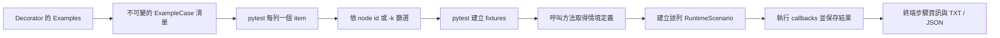

# Outline 逐列測試與可讀結果設計

日期：2026-09-23。狀態：第一版實作及後續缺陷修正完成；Windows／Python 3.11.2 下，pytest 8.3.3 與 9.1.1 各通過完整 189 項測試，範例展開為 26 項並成功產生報告。

## 目標與已確認決策

- 使用者容易閱讀情境、輸入資料、Given／When／Then 及執行結果。
- 每個 Outline 資料列是獨立 pytest item，能在執行前列出、篩選並單獨重跑。
- 未提供 Examples 時沿用 Java 的 no-op；明確傳入空 Examples 集合仍沿用既有參數檢查。
- 使用者已接受將 Examples 放到 decorator，方法回傳情境交由框架執行。
- Pending 沿用目前行為，本次不改為 skip／xfail／failure。

## 使用者 API

新增逐列模式，範例如下；其中 defineScenarioOutline 是本設計新增的宣告入口：

```python
from ezspec import EzFeature, EzScenarioOutline, Feature

ADDITION_CASES = """
| example_code | a | b | total |
| ADD01        | 1 | 2 | 3     |
| ADD02        | 4 | 5 | 9     |
"""


@EzFeature
class AdditionSpec:
    feature = Feature.New("加法")

    @EzScenarioOutline(examples=ADDITION_CASES)
    def add_two_numbers(self):
        def prepare(env):
            env.put("a", env.geti("a"))
            env.put("b", env.geti("b"))

        def add(env):
            env.put("actual", env.geti("a") + env.geti("b"))

        def verify(env):
            assert env.geti("actual") == env.geti("total")

        return (
            self.feature.defineScenarioOutline("兩個數字相加")
            .Given("數字為 <a> 和 <b>", prepare)
            .When("執行加法", add)
            .Then("結果應為 <total>", verify)
        )
```

差異只有：Examples 移到 decorator、使用宣告入口、回傳情境而不自行呼叫 Execute。
需要 named Rule 時，可在 decorator 設 `rule="規則名稱"` 供收集 metadata 使用，並在回傳的定義上呼叫 `.withRule(rule)` 綁定 Rule 與其 Background。
方法可以接收正常 pytest fixtures，例如 `def add_two_numbers(self, tmp_path)`；fixture 可由 callback closure 使用。
宣告函式只建立規格；測試操作和斷言放在 callbacks。

預期收集項目：

```text
test_addition.py::AdditionSpec::add_two_numbers[ADD01]
test_addition.py::AdditionSpec::add_two_numbers[ADD02]
```

可直接指定完整 node id 單列執行。步驟細節的預期文字呈現：

```text
兩個數字相加 [ADD01]  PASSED
  [Success] Given 數字為 <1> 和 <2>
  [Success] When 執行加法
  [Success] Then 結果應為 <3>
```

每列是一個可獨立執行的測試；步驟是該列的執行細節。
保留既有步驟描述替換方式，不在本次改動角括號語意。

## 為什麼分成宣告與執行

現有 Examples 位於測試函式內，pytest 收集時不知道有幾列。
不在收集階段試跑測試方法：方法可能使用 fixtures，也可能產生實際操作的副作用。
只從 decorator 讀取資料，就能先決定測試項目；選取完成、fixtures 建立後，才建立該列情境並執行。



pytest 支援用 `pytest_generate_tests`／`Metafunc.parametrize()` 在收集階段展開測試；本方案使用這條既有機制。[官方參數化文件](https://docs.pytest.org/en/stable/how-to/parametrize.html#basic-pytest-generate-tests-example)

## 核心模型與狀態

| 元件 | 責任與限制 |
| --- | --- |
| `ExampleCase` | 不可變資料快照：Examples 組別索引、組內列索引、全域列索引、表頭、值、穩定 ID；不持有 environment |
| `OutlineDefinition` | 情境名稱、描述、Feature／Rule 歸屬、步驟定義；沒有已執行結果 |
| `Step` 模板與 `StepRegistrationMixin` | 使用尚未執行的 Step 保存 keyword、description、callback、失敗策略；共用既有 DSL 的註冊方法，單列執行時建立新的 Step／Result |
| 單列執行器 | 依 Definition、ExampleCase、Background 建立新的 RuntimeScenario，沿用現有循序／並行引擎 |
| `RunRegistry` | pytest session 內的收集目錄、選取狀態、各次執行的結果快照；不持有 callbacks 或 fixture 物件 |

`Feature.defineScenarioOutline()` 每次建立新的宣告物件，不沿用 Rule 中「同名 Scenario 重用」的快取，也不把宣告物件提前加入已執行的 Feature 樹。
既有 `newScenarioOutline()`、`WithExamples()`、`Execute()` 的語意維持不變。

單列執行前套用既有 `<column>` 替換與 environment 資料填入，建立新的 Step／Result／environment。
`execution_count` 保留資料列原始的一開始為 1 的全域索引；只選 ADD02 不會把它重新編成第 1 列。

Background 沿用現有已執行 environment 的 shallow-copy 語意，不自動重跑，也不對使用者物件擅自 deepcopy。
因此每列框架內部狀態獨立，但使用者刻意放在 Background 或 session fixture 的可變物件仍可能共享。

## pytest adapter

### 收集與參數化

1. Decorator 保存強型別 metadata；以 sentinel 區分「未提供 examples」和「明確傳入 examples」。未提供時是既有模式。
2. `pytest_pycollect_makeitem` 保留非 `Test`／`test_` 名稱支援，但改為走正常的 fixture 分析與函式展開流程，不再直接組裝缺少 fixtureinfo／callspec 的 Function。
3. Adapter 在建立 FunctionDefinition 前加上內部 `usefixtures("_ezspec_case")` 標記；使用者不需要多寫一個參數。
4. `pytest_generate_tests` 將 ExampleCase 清單以 `indirect=True` 參數化到 `_ezspec_case`；fixture 只回傳 `request.param`。
5. 同時使用一般 pytest parametrize 時採笛卡兒積；內部參數名稱禁止使用者占用。一般參數 ID 仍由 pytest 處理。

nonstandard-name 收集透過 `collector._genfunctions()`；相關 pytest 私有介面集中在 `compat.py`，不複製 pytest 內部收集器。
已在 pytest 8.3.3 與 9.1.1 各執行完整 189 項測試，包含真實 subprocess 的逐列收集、fixture、parametrize（位置與具名參數）、decorator 順序、單列重跑及報告驗證；此結果不代表所有中間版本均已逐一驗證。

### 呼叫與結果

新增模式由 `pytest_pyfunc_call` 處理，舊模式及普通測試交回 pytest。
此 hook 在 fixture setup 後呼叫原方法並取得 OutlineDefinition，再執行目前 item 的 ExampleCase，成功時回傳 hook 的 handled 結果，避免 pytest 將宣告物件當作測試回傳值警告。
只傳入原方法實際宣告的 fixture／參數，不把內部 `_ezspec_case` 或 autouse fixtures 直接塞進方法參數。

這使用 pytest 的函式呼叫 hook；setup／teardown 結果由 `pytest_runtest_makereport` 取得。[官方 hooks 文件](https://docs.pytest.org/en/stable/reference/reference.html#pytest.hookspec.pytest_pyfunc_call)

新模式要求回傳一個 OutlineDefinition；回傳 None、已執行情境或多個情境時，提供含方法位置的設定錯誤。
新模式的步驟 callback 必須同步完成，不接受 coroutine、generator 或 async generator。宣告時檢查直接函式，執行時再檢查回傳值，涵蓋 callable object 與同步包裝器，避免斷言未執行卻顯示 Success。此限制不影響正常 pytest yield fixtures。
在 finally 保存已開始執行的步驟結果，然後重新拋出原始失敗，使 pytest 退出碼與 traceback 正常。
setup／teardown 失敗另記為該列測試的 phase 結果，不能因 callback 全成功就覆蓋 fixture 錯誤。

### ID 與顯示名稱

- `example_code` 若存在且不重複，作為 ID；缺少時使用 `e1-r1` 等組別／列序號。
- 重複代碼追加組別與列序號，最後檢查整個 Outline 的 ID 唯一性。
- 不把 Success／Failure 放進 node id，也不執行後改名。
- 框架產生的 ID 對特殊字元採固定編碼，不改 pytest 全域 Unicode 設定；中文情境和完整參數顯示於步驟資訊／報告。
- ID 對相同資料與順序保持穩定；修改無代碼資料的順序可能改變其序號 ID。

## Examples 與零資料行為

| 使用方式 | 設計行為 |
| --- | --- |
| 舊 `@EzScenarioOutline`，方法內原有 DSL | 相容模式，仍是一個 pytest item；要逐列重跑需遷移至新模式 |
| 舊模式沒呼叫 WithExamples | 原樣 no-op，不新增錯誤 |
| 新模式 `examples=[]` 或既有 `WithExamples([])` | 沿用 Java／現有空集合參數檢查錯誤 |
| 新模式可解析表格只有表頭，零資料列 | 產生單一 `[no-examples]` 相容 item；call 階段不呼叫宣告方法或 callbacks，成功 no-op |
| 新模式 `examples=None` 或格式錯誤 | 明確的設定錯誤；不把無效型別當成未提供 |

`[no-examples]` 是相容性佔位項目，不代表有一列驗證成功；終端詳細資訊和報告須明確標示「0 列，未執行步驟」。
仍保留 pytest 的 fixture setup／teardown；其中的實際錯誤正常回報。這符合「不執行情境 callbacks」，不表示免除 pytest 的整體生命週期。
不直接把空清單交給 pytest parametrization，避免其 empty-parameter-set 設定改變這項語意。[pytest 空參數行為](https://docs.pytest.org/en/stable/how-to/parametrize.html)

第一版接受原始表格文字、Example、Examples／PytestExamples 實例和它們的 list／tuple；收集時統一轉成不可變資料快照。
不接受依賴執行期 fixture 才能取得的資料來源。資料提供者在收集前必須可列舉；資料庫操作放在被選取項目的 fixtures／callbacks。

## 終端與報告

- 預設 pytest 顯示逐列結果；新增 `--ezspec-steps` 顯示每列的完整 Gherkin 步驟與狀態。
- 發生失敗時，即使未開此選項，也附加該列輸入和步驟狀態 report section，保留原始 traceback。
- 內部結果同時記錄 `selected`、`started`、`completed` 與 pytest setup／call／teardown outcomes；「未選取」不等於 Pending 或 Skip。
- 原本的 Java-compatible JSON 欄位維持不變，`runtimeScenarioDtos` 只放實際開始執行的列，保留原始 Examples 供閱讀；不製造未選取列的假 Result。
- 在相同報告目錄新增版本化的 `<feature>.execution.json`，記錄收集總數、node id、資料列座標、選取狀態、phase 結果與重跑次數，補足原 JSON 沒有的執行範圍資訊。
- TXT 顯示「共幾列／選取幾列／完成幾列」，並標示零列 no-op；部分執行不呈現成整份 Examples 全部成功。零列 item 的 fixture 錯誤也會出現在 TXT 與終端步驟資訊。
- 每個 TXT Outline 區段明示所屬 Rule（含預設 Rule）、來源方法及其他 pytest 參數，避免同名情境或不同參數組合難以區分。
- 聚合鍵使用方法完整來源＋一般 pytest 參數組合，不只依情境顯示名稱；不同方法同名不合併。不同列的 callback closure 可以不同，但步驟 keyword／描述模板／Rule 必須一致，否則拒絕產生誤導性的單一模板報告。
- `RunRegistry` 放在 pytest Config stash，session 結束輸出一次。新的逐列結果投影與舊 Feature 結果在 report adapter 合併，不修改 class.feature 的既有快取來累積執行狀態。

IDE 的第一版承諾是逐列 pytest node 與可讀失敗資訊；不承諾每個 IDE 都能呈現與 JUnit 相同的步驟子樹。

## 模組調整與實作順序

| 階段 | 檔案／元件 | 完成條件 |
| --- | --- | --- |
| 1. 修正 pytest 整合 | `extension/pytest/plugin.py`、新增 `compat.py` | 原有 decorator 可以使用 fixture／parametrize，既有測試保持通過 |
| 2. 宣告與單列模型 | 新增 `keyword/definition.py`、`keyword/case.py`；調整 `feature.py`、共用步驟註冊／變數替換 | 每次建立全新的 runtime；保持舊 DSL 行為 |
| 3. 逐列收集與執行 | `decorators.py`、新增 `collection.py`、`execution.py` | collect-only 列出資料，單列 node id 只執行該列 |
| 4. 可讀結果 | `reporting.py`、新增 session 結果 registry，調整 TXT／JSON adapter | 成功、失敗、未選取、fixture 錯誤可明確區分 |
| 5. 遷移與文件 | 2 組 Outline examples、2 組既有 Scenario examples、README、真實 pytest 整合測試 | Outline 範例改用新 API；Scenario 範例保留舊格式展示相容性 |

第一版不改 Pending 規則或導入 HTML dashboard，新模式以循序 callbacks 為預設。
並行步驟參數共享問題已於 2026-09-24 後續修正；作用範圍與群組間資料延續方式見 [並行執行說明](CONCURRENT_EXECUTION.md)。
xdist 的跨程序結果合併尚未設計，第一版不宣稱支援新模式的 xdist 報告。

## 後續檢查與修正（2026-09-23）

- 修正 `pytest.mark.parametrize(argnames=..., argvalues=...)` 收集時的 IndexError，並保留內部 `_ezspec_case` 參數的保護。
- 拒絕不會直接執行斷言的 generator／async generator callback，涵蓋直接函式、callable object 與同步包裝器。
- 零列情境仍保留 Java no-op，但終端及 TXT 不再略過 fixture setup／teardown 的 failed 或 skipped 狀態。
- TXT 明示 Outline 的 Rule、來源與一般 pytest 參數，保留既有 Background 內容，且不修改核心 Feature 樹。
- 新增 17 項回歸案例；完整 189 項測試在 pytest 8.3.3 與 9.1.1 均通過（RuntimeWarning 視為錯誤）。26 個範例產生的 TXT、JSON 與 execution sidecar 位於 `build/outline-review-20260923/`。

## 驗收清單

1. 三列資料在 `--collect-only` 顯示三個 items，且宣告方法、callbacks、fixtures 都未被執行；正常模組 import／靜態資料解析仍會發生。
2. 指定第二列 node id 後，只有第二列方法／callbacks 執行，其 execution_count 仍為 2。
3. 每列 function-scope fixture 正確 setup／teardown；class-scope／session-scope 按 pytest 的原有規則共享。
4. 第一列失敗，其他被選取列照常執行；尊重使用者傳入的 `-x`／`--maxfail`。
5. 同一方法配合一般參數化可形成正確組合，無少參數、多收集、重複執行。
6. 同名 Outline 或重跑不追加舊步驟；Result、當前參數與執行次數不沿用前次狀態。
7. 沒 Examples、header-only、空集合、無效資料，分別符合上表；不引入已撤回的缺資料一律失敗規則。
8. 重複 example_code、多組 Examples、中文／特殊字元、巢狀表格能建立唯一且可重跑的 ID。
9. 部分選取、setup 失敗、step 失敗、teardown 失敗和正常完成，TXT／兩種 JSON 與 pytest 結果一致。
10. 單列執行不得偷偷跑其他列以補齊報告。既有循序引擎、Rule／Background、Java API alias、Pending 與報告相容性測試維持通過。

整合驗證以 pytest subprocess／pytester 執行實際收集與 fixture 生命週期，不能只用 FakeConfig 測試 hook。
